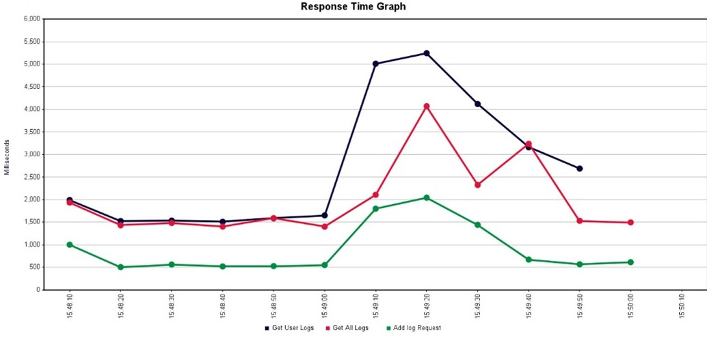
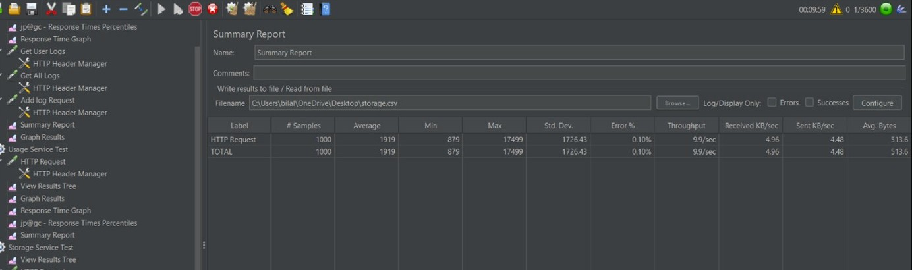

# Video Streaming Application - Backend Microservices 

Welcome to the backend repository of the **Video Streaming Application**! This repository houses all the microservices that power the application. Built with **Node.js** and **Express.js**, each service is containerized using Docker and deployed on **Google Cloud Run** for automatic scaling and efficient resource management.

## 🚀 Project Links

- **Frontend Repository**: [GitHub - Frontend](https://github.com/ahmedbilal008/Video-Streaming-Platfrom-Frontend-)
- **Live Application**: [Cloud Project on Vercel](https://cloud-project-snowy.vercel.app/)
- **Test Credentials**:  
  - Email: `example1@gmail.com`  
  - Password: `123456`  
  *(This account has admin access to view logs)*

---

## 📖 Table of Contents

- [Project Overview](#-project-overview)
- [Features](#-features)
- [Tech Stack](#-tech-stack)
- [Architecture Overview](#-architecture-overview)
- [Environment Setup](#-environment-setup)
- [Security and Authentication](#-security-and-authentication)
- [Database Setup](#-database-setup)
- [Performance Testing](#-performance-testing)
- [Conclusion](#-conclusion)

---

## 📌 Project Overview

This project is a **microservices-based cloud application** designed for **scalable video streaming**. The backend consists of multiple independent services that work together to handle user management, video processing, logging, storage, and usage tracking.

---

## 🎯 Features

- **Microservices Architecture**: Modular services that can scale independently ⚙️  
- **JWT Authentication**: Secure user authentication and authorization 🔒  
- **Video Management**: Handles video uploads, retrievals, and soft deletions 🎥 
- **Logging Service**: Asynchronously records user actions and system events 📝 
- **Storage Management**: Monitors video storage quotas and enforces limits 💾  
- **Usage Monitoring**: Tracks daily bandwidth usage and enforces limits 📊

---

## 🛠 Tech Stack

- **Backend**: Node.js, Express.js (Microservices)  
- **Database**: PostgreSQL (Supabase)  
- **Storage**: Cloudinary  
- **Authentication**: JWT Tokens  
- **Containerization**: Docker  
- **Hosting**: Google Cloud Run

---

## 🏗 Architecture Overview

The backend is built on a **microservices architecture** to ensure flexibility and scalability. Each service communicates with others via secure HTTP APIs.

### **Microservices Overview**
- **User Service**: Manages user registration, login, and JWT token generation.
- **Video Service**: Processes video uploads, retrievals, and deletion.
- **Logging Service**: Captures and stores logs asynchronously.
- **Storage Service**: Monitors and manages video storage quotas.
- **Usage Service**: Tracks daily bandwidth usage and enforces limits.

### **Inter-Service Communication**
1. The **User Service** authenticates users and issues JWT tokens.
2. The **Video Service** handles video processing.
3. The **Logging Service** asynchronously logs system and user activities.
4. The **Storage Service** ensures proper storage quotas.
5. The **Usage Service** tracks and enforces bandwidth usage limits.

---

## 🌎 Environment Setup

Each microservice requires its own `.env` file with variables such as:

```bash
JWT_SECRET=mysecretkey
SUPABASE_URL=https://your-supabase-url
SUPABASE_KEY=your-supabase-key
PORT=3000
```
Ensure a `.env` file is present in each service directory (e.g., `user-service/.env`, `video-service/.env`).

---

## 🔒 Security and Authentication

- **JWT Tokens**: Secure all API endpoints with JWT-based authentication.  
- **Role-Based Access**: Differentiate between admin and standard user permissions.  
- **Secure Communication**: All services use HTTPS for data transmission.

---

## 📊 Database Setup

The backend utilizes **Supabase** to manage PostgreSQL databases with key tables:

### **Users Table**
| Column      | Type      | Description                   |
|-------------|-----------|-------------------------------|
| id          | uuid      | Unique user identifier        |
| email       | text      | User email (unique)           |
| password    | text      | Encrypted password            |
| username    | text      | User's display name           |
| created_at  | timestamp | Account creation date         |
| role        | text      | User role (admin/user)        |
| uploading   | timestamp | Flag for ongoing uploads      |

### **Videos Table**
| Column      | Type           | Description                    |
|-------------|----------------|--------------------------------|
| id          | uuid           | Unique video identifier        |
| user_id     | uuid           | ID of the user who uploaded    |
| filename    | text           | Name of the video file         |
| filepath    | text           | Path to the stored video       |
| title       | text           | Video title                    |
| uploaded_at | timestamp      | Time of upload                 |
| deleted_at  | timestamp      | Soft deletion timestamp        |
| size_mb     | double         | Video size in MB               |

### **Logs Table**
| Column       | Type      | Description                      |
|--------------|-----------|----------------------------------|
| id           | uuid      | Unique log identifier            |
| user_id      | uuid      | Associated user ID               |
| action_type  | varchar   | Type of action logged            |
| description  | text      | Detailed description             |
| service_name | varchar   | Service generating the log       |
| created_at   | timestamp | Time of log creation             |

---

## 📊 Performance Testing

The application was stress-tested using **Apache JMeter** with the following parameters:
- **Simulated Concurrent Users:** 1000  
- **Key Metrics:** Response time under load, API throughput, error rates, and system stability.

### 📉 Performance Graphs
### Logging Service Performance  
  

### User Service Performance  
  

### Video Service Performance  
  

### Storage Service Performance  
  

### Usage Service Performance  
  


---

## 📜 Conclusion

The **Video Streaming Platform Backend** is engineered with scalability, security, and performance in mind. With a robust microservices architecture and seamless inter-service communication, it efficiently handles video processing, user management, logging, and usage tracking.
